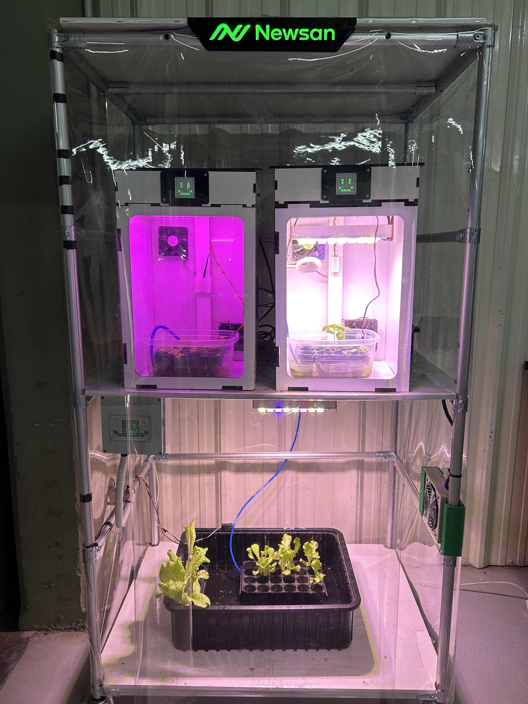
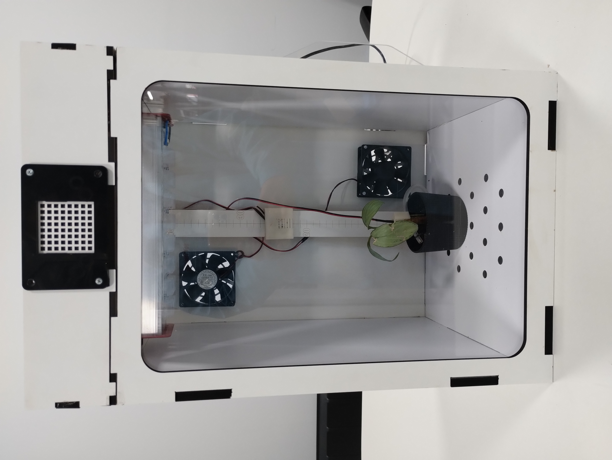
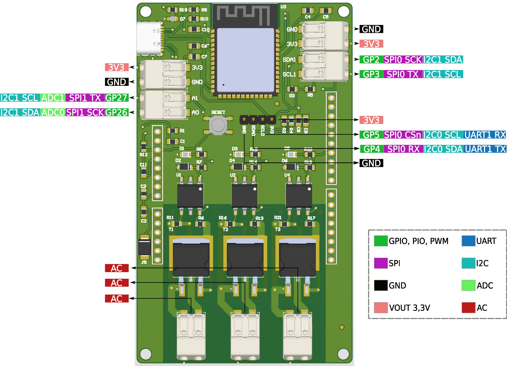

# 🌱 Proyecto de Cultivo en tu propio Smart Indoor
Este proyecto está diseñado para que cualquier persona pueda crear un sistema automatizado de cultivo indoor para lechugas. Usando tecnología accesible, hemos desarrollado un sistema que permite monitorear y optimizar el crecimiento de las plantas en interiores, subiendo los datos adquiridos a la plataforma Thingspeak para su análisis y seguimiento.

# 📖 Descripción
El proyecto de cultivo indoor de lechugas se centra en el desarrollo de un sistema inteligente que controla automáticamente las condiciones de crecimiento de las plantas. Este sistema incluye un conjunto de sensores y actuadores conectados a una placa de control diseñada específicamente para este propósito, llamada Archi Farm Beta. Con este sistema, es posible mantener las condiciones óptimas de luz, temperatura, humedad y riego para asegurar un crecimiento saludable de las lechugas.

# 🔧 Especificaciones Técnicas
- Placa Controladora: Archi Farm Beta, compatible con el microcontrolador Archi y Arduino Uno.
- Sensores Integrados: Sensor de humedad de suelo, sensor de temperatura y humedad ambiental.
- Actuadores: Luces LED Full Spectrum HPR16BOSV1, bomba de agua sumergible 600L/H 8W, coolers 220V AC.
- Alimentación: 220V AC para los actuadores principales y 5V DC para la placa de control y sensores.
- Conectividad: Capacidad de subir datos a Thingspeak mediante conexión Wi-Fi.
- Relés de Estado Sólido: Control de actuadores mediante salidas de relés.

# ⚙️ Esquema de Conexiones
A continuación se presenta el esquema de conexiones del sistema. Este esquema muestra cómo se conectan los sensores, actuadores y la placa controladora Archi Farm Beta.

# 📜 Historia del Proyecto
El proyecto comenzó con la idea de desarrollar un método eficiente y controlado para cultivar lechugas en interiores, especialmente en áreas urbanas donde el espacio y las condiciones climáticas pueden ser limitantes. Tras varias iteraciones, logramos optimizar un sistema que no solo regula el ambiente de las plantas, sino que también permite subir los datos en tiempo real a una plataforma en la nube. De esta manera, cualquier persona puede monitorear y ajustar las condiciones de su cultivo desde cualquier lugar.

La primera versión del sistema utilizaba un método más simple para controlar la humedad y la luz, pero con el tiempo, se incorporaron tecnologías más avanzadas como la conexión a internet y el uso de la placa Archi Farm Beta, que mejoraron significativamente el rendimiento y la eficiencia del cultivo.

# 🗒 Historial de Cambios
v1.0: Primera versión del sistema, basada en un control manual de luces, riego y ventilacion. Tambien incluye conectividad a internet y puertos libre de proposito general.

# 🔗 Links Útiles
- [Archi](https://archikids.com.ar/)
- [Thingspeak](https://thingspeak.com/)
